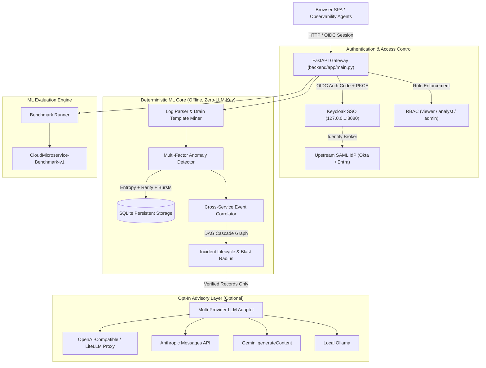

# log-anomaly-detector-alan-vo | Alan Vo | AI & Machine Learning

Current version: `1.1.0`.

Distributed microservice environments generate high-velocity, semi-structured log streams that overwhelm site reliability and security operations teams with alert fatigue while subtle cascading degradations go unnoticed. **log-anomaly-detector-alan-vo** addresses this challenge by pairing a deterministic, offline machine learning pipeline—combining token-based Drain template mining, Shannon token entropy scoring, and sliding-window error burst z-scores—with a temporal cross-service cascade correlation engine and opt-in, grounded multi-provider LLM root-cause advisory. Designed for SREs, platform engineers, and cloud architects, the system operates completely offline without external API keys, while providing structured postmortem generation and SSO authorization.

## Architecture



## AI/ML Evaluation

To evaluate detection quality against standard operational practices, the application includes a reproducible offline benchmarking suite comparing the multi-factor deterministic detector against a naive log-level baseline heuristic (`level == 'ERROR' or level == 'CRITICAL'`).

### Reproducible Command

Run the benchmark directly via the CLI or query the REST endpoint:

```bash
# Via Python CLI (works offline without any external services)
.venv/bin/python main.py benchmark

# Or via REST API
curl -s http://127.0.0.1:8000/api/evaluation/benchmark
```

### Data Provenance
- **Dataset:** `CloudMicroservice-Benchmark-v1`
- **Volume:** 25 curated distributed cloud microservice log traces spanning 6 distinct services (`api-gateway`, `auth-service`, `payment-service`, `db-proxy`, `cache-layer`, `order-service`).
- **Distribution:** 11 ground-truth critical/cascading anomalies, 10 nominal operational traffic traces, and 4 benign error/warning edge cases (e.g., crawler 404s, client disconnects, minor unindexed query warnings).

### Measured Results

| Metric | Naive Log-Level Baseline | Implemented Detector | Delta / Improvement |
|---|---|---|---|
| **F1 Score** | **76.19%** | **91.67%** | **+20.32%** |
| **Precision** | 80.00% | 84.62% | +4.62% |
| **Recall** | 72.73% | 100.00% | +27.27% |
| **Accuracy** | 76.00% | 92.00% | +16.00% |
| **Inference Latency** | — | **3.43 ms / log** | High throughput offline |

### Failure Cases & Boundary Limitations
- **False Positives:** Benign operational errors (such as isolated 404 crawler requests or single password typos) that exhibit high token entropy can occasionally receive elevated anomaly scores on cold boot before template occurrences normalize.
- **Cold-Start Rarity Penalty:** Newly deployed microservices emitting novel log templates for the first time incur a transient template rarity penalty until the frequency baseline registers more than 3 occurrences.
- **Clock Skew:** Temporal window burst evaluation assumes monotonic timestamp ordering across services; high network transit delay in distributed log forwarders can widen the correlation grouping window.

## Core Workflows

1. **Deterministic Template Mining & Anomaly Scoring:**
   - Ingests structured or unstructured logs.
   - Extracts regex templates by replacing UUIDs, IP addresses, timestamps, and parameters with `<*>`.
   - Computes Shannon token entropy, template rarity, and sliding-window service error burst rates to produce a composite anomaly score `[0.0, 1.0]`.

2. **Cross-Service Cascade Correlation & DAG Reconstruction:**
   - Groups anomalies occurring across microservices within temporal windows.
   - Evaluates service dependency topologies (`db-proxy` → `auth-service` → `api-gateway`) to construct a Directed Acyclic Graph (DAG).
   - Picks the root-cause candidate as the most upstream service in that cluster. An earlier instant, then a higher anomaly score, breaks ties. A downstream symptom that is logged first does not become the origin. Event order and edge delays use UTC instants, so mixed offsets do not reverse the timeline.

3. **Opt-In Multi-Provider Advisory & Postmortem Export:**
   - Optional, strictly advisory root-cause synthesis grounded in verified log records.
   - Never fabricates results: returns clear, redacted error states when API credentials are missing or endpoints timeout.
   - Exports complete Markdown or JSON postmortems with incident summaries, causal timelines, and operator remediation notes.

4. **Reproducible ML Evaluation Pipeline:**
   - Computes precision, recall, F1 score, confusion matrix, and inference latency against verified ground-truth datasets.
   - Logs immutable run records to the audit ledger.

## Quick Start & Installation

### Prerequisites
- Python 3.12+
- Node.js 24+
- Docker & Docker Compose (optional for containerized setup)

### Local Development Setup

```bash
# 1. Clone repository
git clone https://github.com/ALANDVO/log-anomaly-detector-alan-vo.git
cd log-anomaly-detector-alan-vo

# 2. Set up Backend
python3 -m venv .venv
source .venv/bin/activate
pip install -r backend/requirements.txt

# 3. Set up Frontend
cd frontend
npm install
cd ..

# 4. Copy configuration
cp .env.example .env
```

### Running Tests

```bash
# Backend pytest suite (20 tests covering domain logic, auth, and API workflows)
PYTHONPATH=backend .venv/bin/python -m pytest -v backend/tests

# Frontend Vitest suite (testing navigation, telemetry, and benchmark views)
cd frontend && npm test && npm run build && cd ..
```

### Running Locally

```bash
# Start backend on 127.0.0.1:8000
PYTHONPATH=backend .venv/bin/uvicorn app.main:app --host 127.0.0.1 --port 8000 --reload

# In a separate terminal, start frontend on 127.0.0.1:3000
cd frontend
npm run dev
```

Visit `http://127.0.0.1:3000` to interact with the dashboard. Local demo mode binds strictly to localhost and allows role switching between `viewer`, `analyst`, and `admin`.

### Running with Docker Compose

```bash
# Builds backend, frontend, and Keycloak SSO binding strictly to 127.0.0.1
docker compose up --build
```

## API Endpoint Reference

| Method | Endpoint | Role Required | Description |
|---|---|---|---|
| `GET` | `/api/health` | Public | System health check and environment status |
| `GET` | `/api/meta` | Public | Version metadata and non-secret provider config |
| `GET` | `/api/auth/me` | Authenticated | Current user identity, role, and CSRF token |
| `GET` | `/api/auth/login` | Public | Initiates Keycloak OIDC authorization code flow |
| `GET` | `/api/auth/callback`| Public | Exchanges OIDC code with PKCE and sets session cookie |
| `POST`| `/api/auth/demo-login`| Local Only | Local-only demo authentication (refused in production) |
| `POST`| `/api/auth/logout` | Authenticated | Clears session cookie and invalidates session |
| `GET` | `/api/logs` | Viewer | Filtered and paginated log records |
| `POST`| `/api/logs/ingest` | Analyst | Ingests, parses, and scores a batch of log records |
| `GET` | `/api/logs/stats` | Viewer | Telemetry statistics, anomaly rates, and trends |
| `GET` | `/api/logs/templates`| Viewer | Lists mined log templates and occurrence frequencies |
| `GET` | `/api/incidents` | Viewer | Lists correlated incident cascades |
| `GET` | `/api/incidents/{id}`| Viewer | Full incident details, correlated logs, and DAG graph |
| `PATCH`|`/api/incidents/{id}`| Analyst | Updates status (`investigating`, `resolved`) and notes |
| `POST`| `/api/incidents/{id}/advisory` | Analyst | Opt-in multi-provider LLM root-cause synthesis |
| `GET` | `/api/incidents/{id}/export` | Viewer | Exports postmortem in Markdown or JSON |
| `GET` | `/api/evaluation/benchmark` | Viewer | Runs reproducible ML benchmark and returns metrics |
| `GET` | `/api/audit` | Admin | Queries administrative audit trails |

## Provider Configuration

All LLM integrations are opt-in and handled strictly server-side. The offline core functions completely without any provider credentials.

| Environment Variable | Description | Default / Example |
|---|---|---|
| `LLM_PROVIDER` | Adapter choice (`openai-compatible`, `anthropic`, `gemini`, `ollama`) | `openai-compatible` |
| `LLM_BASE_URL` | Configurable endpoint URL (LiteLLM proxy, OpenAI, Ollama) | `https://llm.chris-vo.com/v1` |
| `LLM_MODEL` | Target model name | `qwen3.8-27b` |
| `LLM_API_KEY` | Server-side credential (never exposed to client) | *(empty by default)* |

## Single Sign-On (SSO) & Keycloak SAML Setup

Production authentication enforces OIDC Authorization Code Flow with PKCE, server-side sessions, and HttpOnly SameSite cookies. Keycloak is configured as an identity broker capable of federating with upstream SAML 2.0 Identity Providers (such as Okta, Ping Identity, or Microsoft Entra ID).

1. **Pre-Configured Realm Import:**
   The `compose.yaml` stack automatically imports `keycloak/realm-export.json`, defining client `log-anomaly-detector`, user roles (`viewer`, `analyst`, `admin`), and a SAML identity provider broker stub (`saml-idp-broker`).

2. **Upstream SAML IdP Enrollment:**
   - In Keycloak Admin (`http://127.0.0.1:8080`), navigate to **Identity Providers** → **saml-idp-broker**.
   - Import your enterprise IdP metadata XML or specify `Single Sign-On Service URL` and `Entity ID`.
   - In your enterprise IdP, configure the Keycloak Assertion Consumer Service (ACS) URL:
     `http://127.0.0.1:8080/realms/master/broker/saml-idp-broker/endpoint`
   - Map SAML assertion attributes (`email`, `firstName`, `roles`) into Keycloak user attributes.

3. **Production TLS & Reverse Proxy:**
   In production deployments, place backend and Keycloak services behind a TLS reverse proxy (e.g. NGINX, Traefik, or Caddy) enforcing HTTPS and forwarding headers (`X-Forwarded-For`, `X-Forwarded-Proto: https`).

## Security & Operational Limitations

- **Local Demo Isolation:** Demo mode is restricted to `127.0.0.1`. The application verifies runtime safety on startup and refuses to launch in `production` environment if `DEMO_MODE=true`.
- **Double Submit CSRF:** All state-mutating requests (POST, PATCH, DELETE) authenticated via session cookies require an `X-CSRF-Token` header.
- **Token Secrecy:** Tokens are never written to disk, application logs, or audit records.
- **Backup & Recovery:** SQLite state is stored in `data/logs.db`. For persistent backups in Docker, back up the `backend_data` Docker volume or execute standard SQLite `.backup` procedures while in WAL mode.

## License

MIT License — Copyright (c) 2026 Alan Vo <alanvo@gmail.com>

---

**Built by [Alan Vo](https://github.com/ALANDVO)** | `alanvo@gmail.com` | AI & Machine Learning Observability
